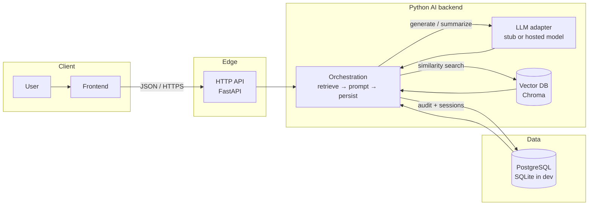

# Day 16 — System architecture

## Diagram (end-to-end)

## Layer-by-layer flow (written)

1. **User** interacts with a **frontend** (web app, mobile app, or internal tool). The user’s question or command is captured as structured input (for example, chat text and optional metadata such as user id and locale).

2. **Frontend** calls the **API** over HTTPS. It sends a minimal payload (for example, `POST /v1/chat` with JSON `{ "message": "..." }`). The frontend is responsible for auth headers, UX validation, and displaying responses (including citations returned by the backend).

3. **API** (this repo: **FastAPI**) validates the request, applies cross-cutting concerns (authentication, rate limiting, logging), and forwards the business payload to the **Python AI backend** service layer. The API remains thin: it should not embed model logic directly; it delegates to orchestration code so the same pipeline can be reused from workers or tests.

4. **Python AI backend** coordinates the intelligent workflow:
   - **Vector DB**: embed the user message (Chroma’s default embedding function here), retrieve the top-k text chunks, and treat those chunks as **grounding context**.
   - **LLM**: build a prompt from the user message plus retrieved context, then call the model (here, a **stub** that echoes context so the stack runs without API keys). In production, this step calls your chosen provider or self-hosted weights.
   - **Persistence**: write a **chat turn** (user text, assistant text, serialized retrieval metadata) to **PostgreSQL** for auditability, analytics, and replay. This repo defaults to **SQLite** when `DATABASE_URL` is unset so Postman works immediately; point `DATABASE_URL` at Postgres to match the architecture diagram in a shared environment.

5. **LLM** returns natural language (or structured JSON if you adopt tool-calling). The orchestration layer merges model output with **citations** derived from vector hits (doc ids, scores) before responding.

6. **Vector DB** stores **embeddings** and chunk text for semantic search. It is optimized for approximate nearest-neighbor lookup, not for transactional guarantees; authoritative business data still belongs in PostgreSQL.

7. **PostgreSQL** holds durable relational data: users, organizations, subscriptions, **audit logs**, and **conversation history** pointers. Vector stores may be rebuilt from source documents; Postgres is the system of record for what was said, by whom, and under which policy version.

## Request path summary

**User → Frontend → API → Python orchestration → (Vector DB + LLM in parallel sequence) → PostgreSQL → API → Frontend → User.**

In this codebase, `app/orchestration.py` is the orchestration step, `app/vector_store.py` wraps Chroma, `app/llm.py` is the LLM seam, and `app/db.py` persists turns to the configured SQL database.
