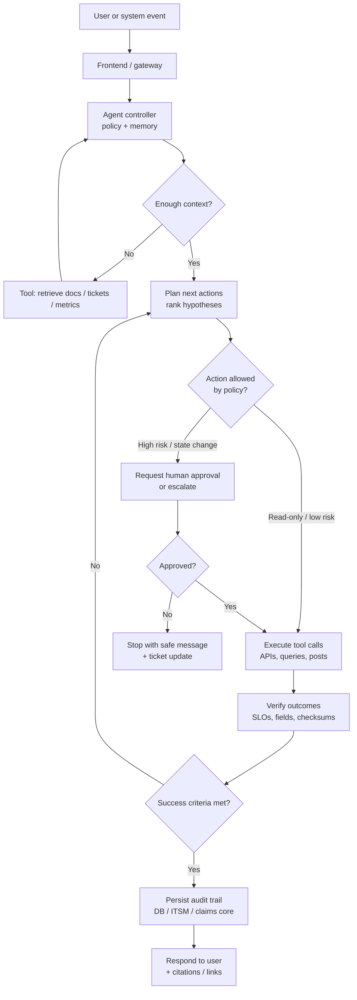

# Day 17 — Three Business Use Cases: Agentic AI vs. Chatbots

**Why agentic AI differs from a chatbot:** a classic chatbot mostly maps user utterances to fixed intents and scripted replies. An **agent** can **plan**, **call tools** (APIs, databases, browsers, ticketing systems), **iterate** when results are incomplete, and **stop** when success criteria or policy gates are met—so it can complete multi-step work that changes state in the real world.

Below are **three** business scenarios where that capability adds clear value.

---

## Use case 1 — Multi-system IT incident triage and first response

### The task

When an on-call engineer or employee reports “checkout is slow” or a monitoring alert fires, the organization must **gather signals**, **classify severity**, **open or update tickets**, **notify the right team**, and **suggest the next mitigation step**—often across observability, chat, and ITSM tools. A chatbot can link to a runbook; an agent can **execute** the first safe steps and only escalate with a filled-in context packet.

### Tools the agent would need

| Tool | Role |
|------|------|
| Monitoring / APM API (e.g., Datadog, Grafana, New Relic) | Pull error rates, latency, deploy markers |
| Log search API | Query correlated traces / stack traces |
| ITSM API (e.g., Jira Service Management, ServiceNow) | Create/update incident, set priority, link alerts |
| Chat / on-call API (e.g., Slack, PagerDuty) | Page duty owner, post status to channel |
| Internal knowledge / runbook search (vector DB or wiki API) | Retrieve known fixes and change windows |
| (Optional) Deployment / feature-flag API | Check recent releases; propose rollback *only* if policy allows |

### Outline of decision steps

1. **Normalize intake** — Parse alert payload or user message; extract service name, time window, customer impact statement.  
2. **Severity rubric** — If error budget burn or revenue-impacting SLO breach → high severity; else standard.  
3. **Evidence gathering** — Query metrics and logs; if data missing, ask one targeted clarifying question *or* widen the time window once.  
4. **Hypothesis shortlist** — Map symptoms to top 2–3 causes using runbooks + recent deploys.  
5. **Action branch** — If a **read-only** mitigation exists (scale read replicas, toggle CDN cache) and policy permits automation → propose command; if **state-changing** (rollback) → require human approval token.  
6. **Ticket hygiene** — Create/update incident with links to graphs, queries, and timeline.  
7. **Stop condition** — Stop when ticket is in “triaged” state with owner + next step, or when human takeover is required.

**Value over a chatbot:** the agent **closes the loop** across systems instead of only answering FAQs.

---

## Use case 2 — B2B procurement: competitive quote intake and comparison packet

### The task

A buyer receives **multiple vendor quotes** (PDFs, spreadsheets, email threads) for the same SKU bundle. The goal is a **comparison matrix** (price, lead time, warranty, payment terms, compliance attestations) and a **recommendation memo** ready for finance/legal review—not a generic summary, but structured fields validated against the RFP checklist.

### Tools the agent would need

| Tool | Role |
|------|------|
| Email / shared drive connector | Pull attachments and thread metadata |
| OCR / document parser | Extract tables from PDFs and scans |
| Spreadsheet API (Excel/Sheets) | Normalize line items into a canonical schema |
| ERP or procurement system API | Pull approved vendors, contracted price bands |
| Compliance registry (SOC2/ISO evidence store) | Verify claims against stored artifacts |
| Workflow tool (e.g., Coupa, internal approval API) | Route packet to approvers with audit trail |

### Outline of decision steps

1. **Ingest** — Collect all quote versions; detect duplicates by hash and sender.  
2. **Schema mapping** — Map each vendor layout to canonical columns; flag missing mandatory fields (tax ID, incoterms, etc.).  
3. **Validation** — Cross-check totals, currency, and line-item math; escalate discrepancies.  
4. **Policy checks** — Enforce “approved vendor list,” region restrictions, and payment-term caps.  
5. **Synthesis** — Build comparison table + ranked recommendation with explicit assumptions.  
6. **Human gate** — If variance vs. budget > threshold or non-approved vendor → require approver sign-off before “final” status.  
7. **Stop condition** — Stop when the comparison packet is complete **or** blocked on a named missing artifact.

**Value over a chatbot:** the agent **transforms unstructured vendor chaos** into **audit-ready structured output** using tools, not just prose.

---

## Use case 3 — Insurance first notice of loss (FNOL) with fraud-aware routing

### The task

A policyholder reports a vehicle claim at night. The insurer must **capture FNOL details**, **retrieve policy coverage**, **schedule inspection or rental** per rules, **detect inconsistencies** (time/location vs. telematics), and **route** to straight-through processing vs. special investigation—all while staying within regulatory scripting and consent.

### Tools the agent would need

| Tool | Role |
|------|------|
| Policy admin / PAS API | Coverage lookup, deductibles, endorsements |
| FNOL / claims core API | Create claim, set reserves, assign adjuster queue |
| Telematics / IoT data API (if consented) | Cross-check location/time narrative |
| Scheduling API (body shop, rental partner) | Book slots within network rules |
| Rules engine or decision table service | Encode jurisdiction-specific mandatory questions |
| Case management + SIU workflow API | Route suspected fraud pathways |
| Document intake (photos) + vision tool | Assess damage cues; flag low-quality uploads |

### Outline of decision steps

1. **Identity and consent** — Verify policyholder, record consent scope for data pulls.  
2. **Coverage gate** — If policy inactive or peril excluded → scripted denial path with escalation offer.  
3. **Structured FNOL** — Ask dynamic follow-ups until minimum fields satisfy jurisdiction rules.  
4. **Consistency checks** — Compare narrative vs. telematics/geo/time; if conflict → SIU branch *without* accusing; request more info.  
5. **Fulfilment** — If straight-through eligible → create claim + schedule within network; else queue human.  
6. **Compliance logging** — Persist transcripts, tool calls, and decision reasons for audit.  
7. **Stop condition** — Stop when claim file is **created with correct status** and customer has **confirmed next appointment** or **explicit handoff** to human.

**Value over a chatbot:** the agent **binds regulated decisions** to **live policy data** and **external schedules**, reducing rework and missed steps.

---

## Agent flow diagram (one representative loop)

This diagram reflects a **generic agentic pattern** (observe → plan → act with tools → verify → finish) applicable to all three use cases above; only the **tool names** and **policy gates** change.

### How to read the diagram

- **Agent controller** holds instructions, safety policy, and short-term memory of prior tool results.  
- **Tool calls** are the differentiator from chatbots: they change or read **external state**.  
- **Policy gates** keep automation inside what the business allows without human oversight.  
- **Verify** prevents “confident wrong completion”; failed verification triggers replanning instead of a dead-end reply.

---

## Summary table

| Use case | Why not “just a chatbot” | Core tools |
|----------|-------------------------|------------|
| IT incident triage | Cross-system evidence + ticket updates | Monitoring, logs, ITSM, chat/on-call |
| Procurement quotes | Unstructured → validated matrix + approvals | Email/drive, parsers, ERP, workflow |
| Insurance FNOL | Regulated, data-bound routing + scheduling | PAS, claims core, telematics, scheduling, rules |
