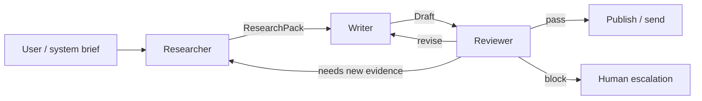

# Day 18 — Three-Agent Workflow and Framework Comparison

## Part A — Three-agent workflow: Researcher → Writer → Reviewer

### Purpose

Split responsibilities so each agent has a **narrow contract**: the **Researcher** gathers and cites evidence; the **Writer** produces a draft that conforms to a brief; the **Reviewer** checks quality, safety, and alignment before anything is published or sent downstream.

### Roles and outputs

| Agent | Primary goal | Typical output artifact |
|-------|----------------|-------------------------|
| **Researcher** | Retrieve trustworthy facts, resolve contradictions, record sources | `ResearchPack`: bullet findings, quotes/links, open questions, confidence notes |
| **Writer** | Turn the pack into the requested deliverable (memo, email, spec section) | `Draft v1`: structured document with citations inline or footnoted |
| **Reviewer** | Enforce rubric: correctness vs. pack, tone, policy, completeness | `ReviewResult`: pass / revise / block, with actionable edits |

### Control flow (written)

1. **Kickoff** — A user or system submits a **brief** (audience, length, must-include facts, forbidden claims, deadline). A router records the brief as immutable context for all agents.  
2. **Researcher pass** — The Researcher runs searches (internal docs, web, tickets—whatever tools are allowed). It **must** attach provenance to each claim. If evidence is thin, it outputs explicit **gaps** instead of guessing.  
3. **Handoff to Writer** — Only the **ResearchPack** (not raw tool dumps) is passed forward to reduce leakage of irrelevant noise and token waste. The Writer is instructed: **do not introduce facts** absent from the pack unless tagged as “user-supplied brief.”  
4. **Writer pass** — The Writer produces the draft in the required format. It may reorganize and summarize, but any factual statement should trace to the pack.  
5. **Handoff to Reviewer** — The Reviewer receives **brief + ResearchPack + Draft**. It checks: (a) **grounding**—every strong claim supported; (b) **style**—voice and length; (c) **policy**—PII, competitor claims, medical/legal disclaimers as applicable.  
6. **Termination rules** — If **pass**, the workflow ends and the draft is released. If **revise**, return to **Writer** with reviewer notes (optionally **Researcher** if new evidence is required). If **block**, stop and escalate to a human without auto-retry loops. A sensible cap is **one** revise cycle without new research, then human.

### Diagram (workflow)

### Why three agents instead of one long prompt

- **Separation of concerns** reduces “creative confabulation” during retrieval.  
- **Reviewer as gate** mirrors human editorial process and is easier to log for compliance.  
- **Clear artifacts** between stages make debugging and regression tests tractable (“which stage failed?”).

---

## Part B — When to use Semantic Kernel vs. direct API calls

**Semantic Kernel (SK)** is an orchestration layer: planners, plugins/skills, memory abstractions, filters, and connectors that wrap model and tool calls with **structure** and **reusability**. **Direct API calls** mean your application calls model HTTP endpoints (and other APIs) with minimal framework—maximum control, minimal opinion.

Below are **three scenarios** where each approach tends to win. These are design heuristics, not absolutes; hybrid patterns are common.

### Three scenarios where Semantic Kernel tends to add value

| # | Scenario | Why SK fits |
|---|----------|-------------|
| 1 | **Enterprise plugin ecosystem** — many internal tools (CRM, HR, ITSM) exposed as skills with shared auth and telemetry | SK’s **plugin model** and **kernel + service** patterns standardize how tools are registered, described to the model, and audited across teams. |
| 2 | **Complex planners and hand-tuned orchestration** — e.g., multi-step agents with retry policies, budgets, and human-in-the-loop gates | SK provides **planners**, **semantic functions**, and **pipelines** so orchestration logic is **composable and testable** instead of scattered `if/else` around raw HTTP. |
| 3 | **Cross-cutting AI middleware** — content safety filters, redaction, PII detection, caching embeddings, or swapping models by policy | SK’s **filters/hooks** and abstractions make it easier to apply **consistent guardrails** around many prompts and tool calls without duplicating wrappers per call site. |

### Three scenarios where direct API calls tend to add value

| # | Scenario | Why direct APIs fit |
|---|----------|---------------------|
| 1 | **Minimal latency microservice** — a single well-defined completion with fixed JSON schema in the hot path | Fewer layers → easier **performance tuning** and **predictable** behavior; SK abstractions may be unnecessary overhead. |
| 2 | **Highly custom orchestration** — bespoke state machines, unusual branching, or tight coupling to your domain runtime | You may fight the framework; **plain code** with explicit HTTP clients often stays **clearer** for experienced engineers. |
| 3 | **Greenfield spike or narrow prototype** — one notebook or script proving a prompt | Direct calls are **fastest to ship**; adopt SK later if plugin reuse and governance requirements appear. |

### Comparison summary

| Dimension | Semantic Kernel | Direct API calls |
|-----------|-----------------|------------------|
| **Governance & reuse** | Strong when many skills and teams share patterns | You build conventions yourself |
| **Time-to-first-request** | Higher setup, pays off at scale | Lowest for tiny scope |
| **Debugging** | Framework stack traces + plugin boundaries | Straight-line code, fewer layers |
| **Portability** | Tied to SK’s model and evolution | Swap HTTP client or vendor with less ceremony |

---

## Part C — End-to-end flow (narrative)

A **brief** enters the system. The **Researcher** executes allowed retrieval tools, normalizes findings into a **ResearchPack** with citations and gaps. The **Writer** consumes only that pack plus the brief, producing a **Draft** that respects format and does not invent facts. The **Reviewer** compares draft to pack and brief; on **pass**, the system emits the final artifact to a channel or store; on **revise**, the Writer applies bounded edits; on **block**, a human intervenes. Telemetry should log which agent ran which tools and which pack version was used, so regressions can be traced.

**Framework choice:** if the same organization will register dozens of internal tools, enforce filters, and reuse planners across products, **Semantic Kernel** often reduces long-term complexity. If the workload is a **single hot-path completion** or **idiosyncratic orchestration**, **direct API calls** (with your own thin module) are often simpler and faster.
