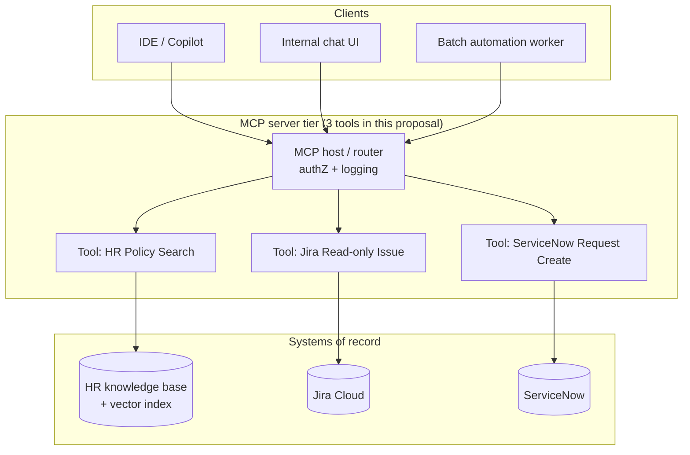

# MCP Proposal — Acme Enterprise AI Assistant

**Context:** Acme wants assistants (IDE copilots, internal chat, ticket triage) to call **approved enterprise systems** through a **Model Context Protocol (MCP)** server fleet, instead of ad-hoc API keys inside every client.

**Goals:** least-privilege access, centralized audit, consistent input/output schemas, and clear separation between **MCP tool surface** and **backend systems of record**.

---

## Architecture (high level)



**Narrative flow:** Clients speak MCP to a **hosted MCP router** that validates OAuth2 bearer tokens, enforces **per-tool** scopes (`hr:policy:read`, `jira:issue:read`, `snow:catalog:write`), and writes **structured audit events** (who, tenant, tool, hashed inputs, latency, outcome). Each tool adapter translates MCP JSON-RPC into the vendor’s REST API with **service accounts** or **on-behalf-of** delegation as approved by security.

---

## Tool 1 — `hr_policy_search`

**Purpose:** Semantic search over the **employee handbook**, **travel/expense policy**, and **code of conduct** with mandatory citations—no free-form HR legal advice.

### MCP tool metadata (illustrative)

| Property | Value |
|----------|--------|
| **Name** | `hr_policy_search` |
| **Description** | Search approved HR policy documents and return ranked excerpts with source titles and deep links. |
| **Risk class** | Read-only; PII redaction on output |

### Inputs (arguments schema)

```json
{
  "type": "object",
  "required": ["query"],
  "properties": {
    "query": {
      "type": "string",
      "minLength": 3,
      "maxLength": 500,
      "description": "Natural language question or keywords."
    },
    "locale": {
      "type": "string",
      "enum": ["en", "de", "fr"],
      "default": "en"
    },
    "top_k": {
      "type": "integer",
      "minimum": 1,
      "maximum": 8,
      "default": 5
    }
  }
}
```

### Outputs (structured content returned to the model)

```json
{
  "type": "object",
  "required": ["hits", "disclaimer"],
  "properties": {
    "hits": {
      "type": "array",
      "items": {
        "type": "object",
        "required": ["title", "url", "excerpt", "score"],
        "properties": {
          "title": { "type": "string" },
          "url": { "type": "string", "format": "uri" },
          "excerpt": { "type": "string", "maxLength": 1200 },
          "score": { "type": "number" }
        }
      }
    },
    "disclaimer": {
      "type": "string",
      "const": "Not legal advice; confirm with HR for your situation."
    }
  }
}
```

### Operational notes

- **Caching:** 5-minute TTL per `(tenant, query_hash, locale)` to cut cost.  
- **Grounding:** Model must cite `url` when asserting policy facts in downstream UIs.

---

## Tool 2 — `jira_get_issue`

**Purpose:** Read-only fetch of a Jira issue for **triage summarization** and **duplicate detection** prompts—no transitions, no comments posted.

### Inputs

```json
{
  "type": "object",
  "required": ["issue_key"],
  "properties": {
    "issue_key": {
      "type": "string",
      "pattern": "^[A-Z][A-Z0-9]+-[0-9]+$",
      "description": "Project key + number, e.g. CORE-4412."
    },
    "fields": {
      "type": "array",
      "items": { "type": "string" },
      "description": "Optional allowlist of Jira field ids to return.",
      "default": ["summary", "description", "status", "priority", "issuetype", "labels"]
    }
  }
}
```

### Outputs

```json
{
  "type": "object",
  "required": ["issue_key", "self", "fields"],
  "properties": {
    "issue_key": { "type": "string" },
    "self": { "type": "string", "format": "uri" },
    "fields": { "type": "object", "additionalProperties": true }
  }
}
```

`fields` mirrors a **redacted** subset of Jira’s issue JSON (internal URLs scrubbed per tenant policy).

### Operational notes

- **Scope:** `jira:issue:read` only; deny if issue’s project not in tenant allowlist.  
- **Rate limit:** 60/min per user + global token bucket for Jira API.

---

## Tool 3 — `servicenow_create_catalog_request`

**Purpose:** Open a **pre-approved** ServiceNow catalog request (hardware, access package, VPN profile) with structured answers—bounded writes for fulfillment tracking.

### Inputs

```json
{
  "type": "object",
  "required": ["catalog_item_sys_id", "variables"],
  "properties": {
    "catalog_item_sys_id": {
      "type": "string",
      "pattern": "^[a-f0-9]{32}$",
      "description": "Allowlisted catalog item in ServiceNow."
    },
    "variables": {
      "type": "object",
      "additionalProperties": { "type": "string", "maxLength": 4000 },
      "description": "Snake_case variable names as defined per catalog item."
    },
    "requested_for": {
      "type": "string",
      "description": "Email or employee id; must match token subject unless caller has delegate scope."
    }
  }
}
```

### Outputs

```json
{
  "type": "object",
  "required": ["request_number", "sys_id", "state"],
  "properties": {
    "request_number": { "type": "string" },
    "sys_id": { "type": "string" },
    "state": { "type": "string" },
    "portal_url": { "type": "string", "format": "uri" }
  }
}
```

### Operational notes

- **Allowlist:** MCP server maps `catalog_item_sys_id` → **known** items only (no arbitrary items).  
- **Human-in-the-loop:** Items with `cost_center > threshold` return `state: pending_approval` without opening SN until approver webhook confirms (optional extension).  
- **Scope:** `snow:catalog:write` + per-catalog sub-scope.

---

## Security and governance (cross-cutting)

| Control | Implementation |
|---------|------------------|
| **Authentication** | OAuth2 bearer at MCP router; short-lived tokens |
| **Authorization** | ABAC: tenant + group + tool + catalog item allowlists |
| **Audit** | Append-only log: tool name, args hash, row counts, latency, `request_id` |
| **Secrets** | Vault-backed service principals; no keys in client binaries |
| **Data residency** | Router pins tool traffic to EU/US cells per `GET /policies/effective` |

---

## Rollout plan (summary)

1. **Pilot:** `hr_policy_search` + `jira_get_issue` read-only in one BU.  
2. **Expand:** Add `servicenow_create_catalog_request` with two catalog items and delegate rules.  
3. **Scale:** Per-tenant MCP replicas + synthetic monitors for each tool SLO.

---

## Relation to `API_CONTRACT.md`

The HTTP gateway (`POST /completions`, etc.) is the **product-facing** surface for apps that do not speak MCP. **MCP tools** are the **agent-native** surface: same policies (`tools_allowed`, `retrieval_indexes`) should be enforced in both paths so behavior stays consistent whether the client is a browser or an MCP-capable assistant.
